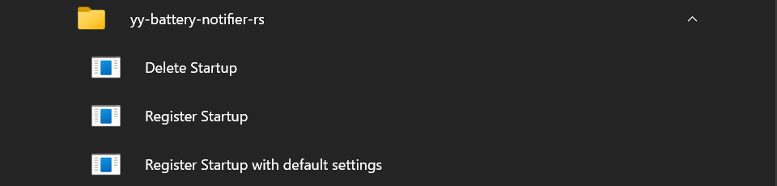
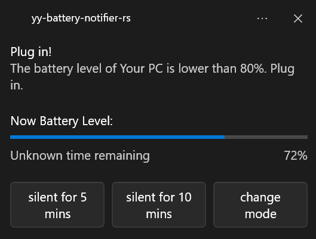
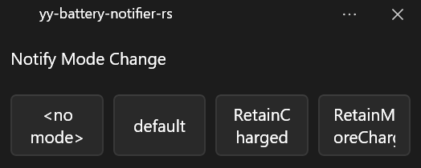
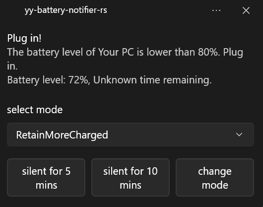
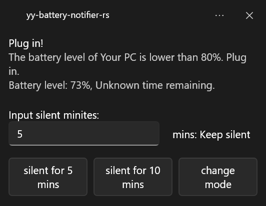
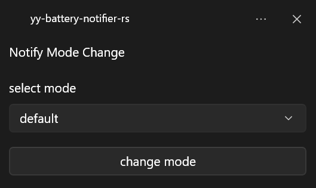
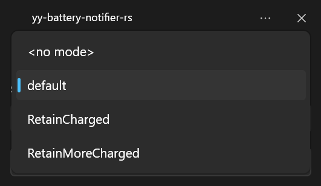

Languages: [English](https://github.com/yy-tromb/yy-battery-notifier-rs) | 日本語(Japanese)

# yy-battery-notifier-rs
バッテリー残量に応じて通知を表示

> [!IMPORTANT]
> このアプリは現在***windows 10,11 のみ***に対応。これは WinRT API( Windows.Devices.Power.Battery と Windows.System.Power.PowerManager )を使っている関係と、[Rustのプラットフォームサポート](https://doc.rust-lang.org/beta/rustc/platform-support.html)によるもの。

> [!IMPORTANT]
> WinRT の notification API には Application User Model ID が必要。MSI インストーラでインストールする場合、Application User Model ID が Windows レジストリに設定されるため、すぐに通知可能。

## インストール

[Github Releases](https://github.com/yy-tromb/yy-battery-notifier-rs/releases)からダウンロード可能。MSI インストーラによるインストールを推奨。  
または、[Cargo](https://doc.rust-lang.org/cargo/) を使って以下のようにビルド...  
通常のリリースビルド: `cargo build --release` か `cargo b -r`  
gui featureを付けてビルド: `cargo build --release --features gui` か `cargo b -r --features gui`

### MSI Installer
[Github Releases](https://github.com/yy-tromb/yy-battery-notifier-rs/releases)からダウンロード可能。  
デフォルトのインストール場所は `%ProgramFiles%\yy-tromb\yy-battery-notifier-rs\` です。  
コントロールパネルまたは設定アプリからアンインストール出来ます。  
インストーラは、スタートメニューに以下のようにショートカットを作成します...

- Delete Startup: Windows レジストリからスタートアップ設定を削除。
- Register Startup: Windows レジストリにユーザーが(入力して)指定した設定で、スタートアップとして登録。
- Register Startup with Default Settings: Windows レジストリに[デフォルトの設定](https://github.com/yy-tromb/yy-battery-notifier-rs/blob/main/docs/ja/default_settings.toml)でスタートアップとして登録。

</details>

## 通知の使い方
### 通知メソッド: "TauriWinrtToast"
#### バッテリ残量の通知


#### モード変更の通知


### メソッド: "WinrtToastReborn"
#### バッテリ残量の通知 (input_type = "ModeSelector")


#### バッテリ残量の通知 (input_type = "SilentSpecifiedMinutes")


#### モード変更の通知



## CLIの使い方
### 指定された settings.toml の設定で通知を開始
`yy-battery-notifier-rs.exe -s "settings.toml へのパス"`

### デフォルトの設定 ([ja/default_settings.toml](https://github.com/yy-tromb/yy-battery-notifier-rs/blob/main/docs/ja/default_settings.toml)) で通知を開始
`yy-battery-notifier-rs.exe -d`

### サブコマンド
  aumid - register,delete : 通知に使われる Application User Model Id を Windows レジストリに登録、または削除。  
  startup - register,delete : このアプリをスタートアップに登録、または削除。 複数回登録した場合でも設定は上書きされる。

### オプション

  -s, --settings "settings.toml へのパス"  \[デフォルト: .\settings.toml]  
  -d, --default_settings : [ja/default_settings.toml](https://github.com/yy-tromb/yy-battery-notifier-rs/blob/main/docs/ja/default_settings.toml) を使う  
      --msgbox : エラー発生をmsgboxで知らせる  
  -h, --help : ヘルプを表示  
  -V, --version : バージョンを表示  


## settings.toml について

TOML のフォーマットについてはググってください...

> [!NOTE]
> `TauriWinrtToast` メソッドは input 要素を実装していないため、`notification_method` が `TauriWinrtToast` のとき、それぞれの notification setting に対しての"input_type" フィールドは無視されます。

### [ja/default_settings.toml](https://github.com/yy-tromb/yy-battery-notifier-rs/blob/main/docs/ja/default_settings.toml)

```ja/default_settings.toml
check_interval = 60
# バッテリ残量を確認する間隔(秒)

# ==================================================
# 任意のフィールドここから

notification_method = "TauriWinrtToast"
# 任意のフィールド
# 通知方法(通知に使用するクレート)を定義。
# 現在の選択肢: "TauriWinrtToast"(デフォルト), "WinrtToastReborn"

mode_names = [""]
# 任意のフィールド
# モードの順番を定義。
# 内部でハッシュテーブルを利用するため、モードの順番は、多くの場合でファイルに書かれた順番とは異なる。
# そのため、このフィールドを使うことでモードの順番を定められる。
# このフィールドに記述されていないモードは、記述されているモードの後に追加される。
# `notifications`が設定されていないモードは追加されない。

initial_mode = ""
# 任意のフィールド
# 起動時のモードを定義。
# デフォルトはモードなし（""）。

abort_on_error_except_initialize = false
# 任意のフィールド
# 起動時を除き、エラー発生にアプリを終了するかを定義。
# 選択肢: true, false(デフォルト)

notify_battery_during_change_mode = false
# 任意のフィールド
# モード変更通知表示時にバッテリ残量を通知するかを定義。
# 選択肢: true, false(デフォルト)

select_mode_when_starts = true
# 任意のフィールド
# 起動時にモードを選択するかを定義。
# 選択肢: true(デフォルト), false

wait_seconds_after_select_mode_notify_when_starts = 10
# 任意のフィールド
# 起動時のモード変更通知後に待機する時間を定義。
# デフォルトは10秒。


# 任意のフィールドここまで
# ==================================================

[[notifications]]
# `notifications` の定義は任意ではあるものの、それぞれの通知設定において任意ではないフィールドは必須。
# このフィールドでは、モードに関係なく常にされる通知を定義。

percentage = "90+"
# 通知が開始される条件を定義。
# 残量のパーセンテージ(整数)と"+" か "-"の接尾辞からなる。
# この例では、バッテリ残量が90%を超えたら通知が開始。

power_supply = "Adequate"
# 通知が開始される充電状態を定義。
# "Adequate"(十分な電力での充電), "InAdequate"(不十分な電力での充電), "None"(充電されていない).

title = "Remove the plug!"
# 通知のタイトルを定義。

message = "Your PC is now fully charged. Remove the plug"
# 通知のメッセージを定義。

input_type = "SilentSpecifiedMinutes"
# 任意のフィールド
# 通知の`input`要素のタイプを定義。
# 選択肢: "ModeSelector"(デフォルト), "SilentSpecifiedMinutes"(通知停止分数を指定)
# "TauriWinrtToast" メソッドは`input`要素を実装していないため、このフィールドは無視される。

[[notifications]]
percentage = "45-"
power_supply = "None"
title = "Plug in!"
message = "The battery level of Your PC is low. Plug in."
```

### modes を使った設定
> [!IMPORTANT]
> `modes` 機能はバージョン 0.4.0 以降で利用可能。

```settings_mode_partial.toml
check_interval = 60
# バッテリ残量を確認する間隔(秒)

mode_names = ["default","RetainCharged","RetainMoreCharged"]
# 任意のフィールド
# モードの順番を定義。
# 内部でハッシュテーブルを利用するため、モードの順番は、多くの場合でファイルに書かれた順番とは異なる。
# そのため、このフィールドを使うことでモードの順番を定められる。
# このフィールドに記述されていないモードは、記述されているモードの後に追加される。
# `notifications`が設定されていないモードは追加されない。

initial_mode = "default"
# 任意のフィールド
# 起動時のモードを定義。
# デフォルトはモードなし（""）。

# =======================================================

[[modes.default.notifications]]
# TOMLの構文の中でモードの名前は自由。
# この例においては、モードが "default" であるときの通知設定を定義。

percentage = "92+"
# 通知が開始される条件を定義。
# 残量のパーセンテージ(整数)と"+" か "-"の接尾辞からなる。
# この例では、バッテリ残量が90%を超えたら通知が開始。

power_supply = "Adequate"
# 通知が開始される充電状態を定義。
# "Adequate"(十分な電力での充電), "InAdequate"(不十分な電力での充電), "None"(充電されていない).

title = "Remove the plug!"
# 通知のタイトルを定義。

message = "Your PC is now fully charged. Remove the plug."
# 通知のメッセージを定義。

input_type = "ModeSelector"
# 任意のフィールド
# 通知の`input`要素のタイプを定義。
# 選択肢: "ModeSelector"(デフォルト), "SilentSpecifiedMinutes"(通知停止分数を指定)
# "TauriWinrtToast" メソッドは`input`要素を実装していないため、このフィールドは無視される。
```

<details>
<summary>全てを展開</summary>

```settings_mode.toml
check_interval = 60
# バッテリ残量を確認する間隔(秒)

notification_method = "TauriWinrtToast"
# 任意のフィールド
# 通知方法(通知に使用するクレート)を定義。
# 現在の選択肢: "TauriWinrtToast"(デフォルト), "WinrtToastReborn"

mode_names = ["default","RetainCharged","RetainMoreCharged"]
# 任意のフィールド
# モードの順番を定義。
# 内部でハッシュテーブルを利用するため、モードの順番は、多くの場合でファイルに書かれた順番とは異なる。
# そのため、このフィールドを使うことでモードの順番を定められる。
# このフィールドに記述されていないモードは、記述されているモードの後に追加される。
# `notifications`が設定されていないモードは追加されない。

initial_mode = "default"
# 任意のフィールド
# 起動時のモードを定義。
# デフォルトはモードなし（""）。

# =======================================================

[[modes.default.notifications]]
# TOMLの構文の中でモードの名前は自由。
# この例においては、モードが "default" であるときの通知設定を定義。

percentage = "92+"
# 通知が開始される条件を定義。
# 残量のパーセンテージ(整数)と"+" か "-"の接尾辞からなる。
# この例では、バッテリ残量が90%を超えたら通知が開始。

power_supply = "Adequate"
# 通知が開始される充電状態を定義。
# "Adequate"(十分な電力での充電), "InAdequate"(不十分な電力での充電), "None"(充電されていない).

title = "Remove the plug!"
# 通知のタイトルを定義。

message = "Your PC is now fully charged. Remove the plug."
# 通知のメッセージを定義。

input_type = "ModeSelector"
# 任意のフィールド
# 通知の`input`要素のタイプを定義。
# 選択肢: "ModeSelector"(デフォルト), "SilentSpecifiedMinutes"(通知停止分数を指定)
# "TauriWinrtToast" メソッドは`input`要素を実装していないため、このフィールドは無視される。

[[modes.default.notifications]]
percentage = "30-"
power_supply = "None"
title = "Plug in!"
message = "The battery level of Your PC is low. Plug in."

# =======================================================

[[modes.RetainMoreCharged.notifications]]
percentage = "96+"
power_supply = "Adequate"
title = "Remove the plug!"
message = "Your PC is now fully charged. Remove the plug."


[[modes.RetainMoreCharged.notifications]]
percentage = "81-"
power_supply = "None"
title = "Plug in!"
message = "The battery level of Your PC is lower than 80%. Plug in."

# =======================================================

[[modes.RetainCharged.notifications]]
percentage = "96+"
power_supply = "Adequate"
title = "Remove the plug!"
message = "Your PC is now fully charged. Remove the plug."


[[modes.RetainCharged.notifications]]
percentage = "70-"
power_supply = "None"
title = "Plug in!"
message = "The battery level of Your PC is lower than 65%. Plug in."
```

## やること
- [x] ~モード変更ボタン~
- [x] ~起動時のモード選択~
- [ ] win32_notif クレートを使用した通知
- [ ] tray_icon クレートを使用してタスクバーにアイコンを表示
